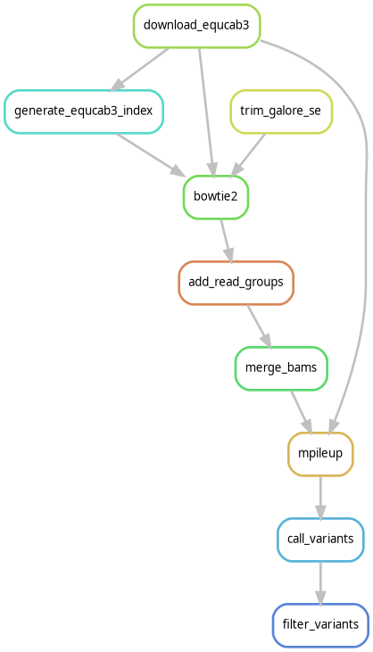

# Overview
This repository contains code for the variant calling pipeline used to call variants in our manuscript available at https://doi.org/10.1007/s12686-022-01259-2 as a Snakemake workflow. This manuscript looked at the use of Allegro Targeted Genotyping from Tecan genomics (formerly Nugen) on fecal swab samples for obtaining genome-wide SNP data. Below is a directed acyclic graph (DAG) of the workflow: 



To run this pipeline, edit parameters in the `config.yml` to specify: the desired version of the EquCab reference genome (2 or 3), whether a targets file will be provided, and parameters for TrimGalore and bcftools filtering. Then the pipeline itself can be run using (when in the workflow directory):
```
snakemake -c1 --use-conda
```

Adjust the number of cores `-c` as desired.

# TODO

- 
