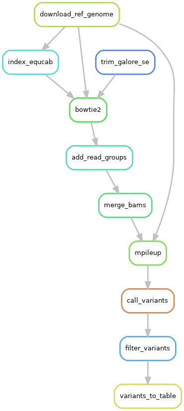

# Overview
This repository contains code for the variant calling pipeline used to call variants in our manuscript available at https://doi.org/10.1007/s12686-022-01259-2 as a Snakemake workflow. This manuscript looked at the use of Allegro Targeted Genotyping from Tecan genomics (formerly Nugen) on fecal swab samples for obtaining genome-wide SNP data. Below is a directed acyclic graph (DAG) of the workflow: 



To run this pipeline, edit the config.yml file to specify whether you would like the EquCab3 reference genome (newest genome for horses) to be pulled automatically. The workflow is set up to do this automatically, but if one prefers they could move or copy the necessary files over and rename them (whole genome fasta as "genome.fa" and all bowtie2 index files named with the prefix "genome"). A targets file can also be specified if desired (as a .tsv with a column for chromosome and position in bp, enable in config).

Then the pipeline itself can be run using (when in the workflow directory):
```
snakemake -c1 --use-conda
```

# TODO
- Accommodate paired end reads